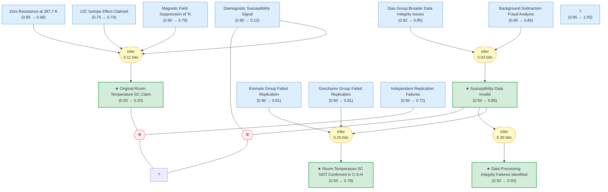

# csh-superconductivity-gaia

Gaia knowledge package: Room-temperature superconductivity in a carbonaceous sulfur hydride (Snider et al., Nature 586, 373, 2020; RETRACTED 2022)

<!-- badges:start -->
<!-- badges:end -->

## Overview

> [!TIP]
> **Reasoning graph information gain: `0.7 bits`**
>
> Total mutual information between leaf premises and exported conclusions — measures how much the reasoning structure reduces uncertainty about the results.

## Conclusions

| Label | Content | Prior | Belief |
|-------|---------|-------|--------|
| data_integrity_failure | The Snider et al. C-S-H paper exhibited data processing integrity failures: n... | 0.50 | 0.92 |
| original_sc_claim | Room-temperature superconductivity was achieved in a carbonaceous sulfur hydr... | 0.50 | 0.20 |
| rtsc_not_confirmed | Room-temperature superconductivity in the C-S-H system, as claimed by Snider ... | 0.50 | 0.78 |
| susceptibility_data_invalid | The magnetic susceptibility data in Snider et al. are unreliable and cannot b... | 0.50 | 0.85 |

<!-- content:start -->
<!-- content:end -->
