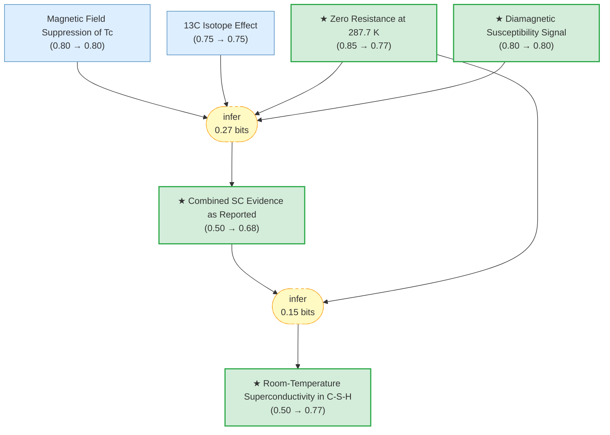

# csh-superconductivity-gaia

Gaia knowledge package: Room-temperature superconductivity in a carbonaceous sulfur hydride (Snider et al., Nature 586, 373, 2020; RETRACTED 2022)

<!-- badges:start -->
<!-- badges:end -->

## Overview

> [!TIP]
> **Reasoning graph information gain: `0.4 bits`**
>
> Total mutual information between leaf premises and exported conclusions — measures how much the reasoning structure reduces uncertainty about the results.

## Conclusions

| Label | Content | Prior | Belief |
|-------|---------|-------|--------|
| original_sc_evidence | The original paper presented four lines of evidence for room-temperature supe... | 0.50 | 0.68 |
| resistance_observation | Four-probe electrical resistance measurements in the DAC showed sharp drops t... | 0.85 | 0.77 |
| room_temperature_sc | Room-temperature superconductivity was achieved in a carbonaceous sulfur hydr... | 0.50 | 0.77 |
| susceptibility_observation | AC magnetic susceptibility measurements up to 190 GPa showed a diamagnetic si... | 0.80 | 0.80 |

<!-- content:start -->
<!-- content:end -->
