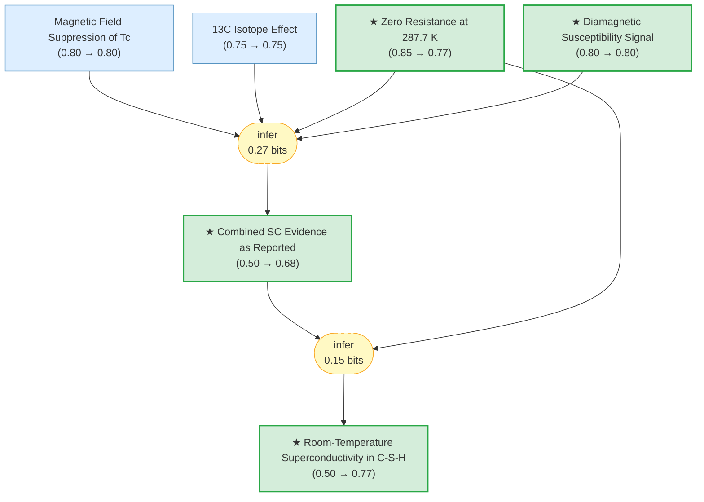

# Room-Temperature Superconductivity in a Carbonaceous Sulfur Hydride

> **Original work:** E. Snider, N. Dasenbrock-Gammon, R. McBride, M. Debessai, H. Vindana, K. Vencatasamy, K.V. Lawler, A. Salamat & R.P. Dias. "Room-temperature superconductivity in a carbonaceous sulfur hydride." *Nature* **586**, 373--377 (2020). [DOI:10.1038/s41586-020-2801-z](https://doi.org/10.1038/s41586-020-2801-z)

> [!NOTE]
> This package formalizes the internal reasoning of the original paper, taken at face value. Belief values reflect the graph's probabilistic assessment of each claim's support based on the paper's own evidence. For post-publication critique and retraction analysis, see the [hirsch-csh-critique](https://github.com/kunyuan/hirsch-csh-critique-gaia) package.

## Summary

Snider et al. report superconductivity at Tc = 287.7 +/- 1.2 K (approximately 15 C) in a photochemically synthesized carbonaceous sulfur hydride (C-S-H) system under 267 +/- 10 GPa -- what would be the first observation of room-temperature superconductivity. Building on the H3S (203 K) and LaH10 (250 K) precedents, the authors introduced methane into the H2S + H2 precursor mixture to chemically tune the system toward higher Tc. Four lines of evidence are presented: zero electrical resistance, diamagnetic susceptibility (Meissner effect), magnetic field suppression of Tc, and a 13C isotope effect consistent with BCS phonon-mediated superconductivity.

## Overview

> [!TIP]
> **Reasoning graph information gain: `0.4 bits`**
>
> Total mutual information between leaf premises and exported conclusions -- measures how much the reasoning structure reduces uncertainty about the results.

## Reasoning Structure

### Room-temperature superconductivity in C-S-H (belief: 0.77)

The headline claim receives moderate-high belief, reflecting that the paper's internal evidence is coherent but the extraordinary nature of the claim prevents belief from reaching the ceiling. The claim is supported by a deduction from four experimental observations (combined into `original_sc_evidence`) plus the pressure-Tc phase diagram showing maximum Tc = 287.7 K at 267 GPa.

**Evidence support:**
- **Zero resistance** (prior 0.85, belief 0.77): Four-probe measurements in the DAC showing sharp resistance drops at multiple pressures. Standard technique, well-calibrated.
- **Diamagnetic susceptibility** (prior 0.80, belief 0.80): AC susceptibility showing Meissner effect. This is the key evidence for *bulk* superconductivity -- without it, zero resistance could be filamentary.
- **Magnetic field suppression** (prior 0.80, belief 0.80): Tc reduced under external magnetic field, consistent with type-II superconductor behavior.
- **13C isotope effect** (prior 0.75, belief 0.75): Carbon-13 substitution showed Tc shift consistent with BCS mechanism. Less conventional than H/D substitution.

### Combined SC evidence (belief: 0.68)

The four-pillar argument (resistance + susceptibility + field + isotope) is a standard framework for establishing superconductivity. The combined belief (0.68) is moderate because the four observations are not fully independent -- they all come from the same DAC setup and sample preparation.

## Conclusions

| Label | Content | Prior | Belief |
|-------|---------|-------|--------|
| room_temperature_sc | Room-temperature superconductivity was achieved in C-S-H at Tc = 287.7 K under 267 GPa | 0.50 | 0.77 |
| original_sc_evidence | Four lines of evidence (resistance, susceptibility, field, isotope) support bulk SC | 0.50 | 0.68 |
| susceptibility_observation | Diamagnetic signal consistent with Meissner effect at temperatures matching Tc | 0.80 | 0.80 |
| resistance_observation | Zero resistance observed at multiple pressures up to 287.7 K | 0.85 | 0.77 |

## Context in Superconductivity Trilogy

This paper is the third in a series of high-pressure hydride superconductivity discoveries:

1. **H3S at 203 K** (Drozdov et al., Nature 2015) -- [h3s-superconductivity-gaia](https://github.com/kunyuan/h3s-superconductivity-gaia)
2. **LaH10 at 250 K** (Drozdov et al., Nature 2019) -- [lah10-superconductivity-gaia](https://github.com/kunyuan/lah10-superconductivity-gaia)
3. **C-S-H at 287.7 K** (Snider et al., Nature 2020) -- this package

Evidence Gaps

- No X-ray diffraction data identifying the C-S-H crystal structure
- The exact composition and stoichiometry of the superconducting phase are unknown
- The photochemical synthesis procedure is non-standard, making independent replication difficult
- Pressure determination at >250 GPa has significant uncertainty
- The background subtraction procedure for susceptibility data was not fully specified

