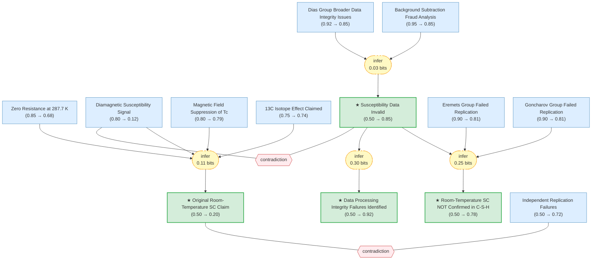

# Room-Temperature Superconductivity in a Carbonaceous Sulfur Hydride

> **Original work:** E. Snider, N. Dasenbrock-Gammon, R. McBride, M. Debessai, H. Vindana, K. Vencatasamy, K.V. Lawler, A. Salamat & R.P. Dias. "Room-temperature superconductivity in a carbonaceous sulfur hydride." *Nature* **586**, 373--377 (2020). [DOI:10.1038/s41586-020-2801-z](https://doi.org/10.1038/s41586-020-2801-z)

> [!CAUTION]
> **THIS PAPER WAS RETRACTED** by Nature editors on 26 September 2022. [Retraction note](https://doi.org/10.1038/s41586-022-05294-9). The magnetic susceptibility data used a non-standard background subtraction procedure that independent analysis showed to be consistent with data fabrication. Two independent groups failed to replicate the room-temperature Tc. This formalization shows how the evidence chain breaks when key data are unreliable.

> [!NOTE]
> This README is an AI-generated analysis based on a [Gaia](https://github.com/SiliconEinstein/Gaia) reasoning graph formalization. Belief values reflect the graph's probabilistic assessment of each claim's support after accounting for contradictions from retraction evidence, not the original authors' confidence.

## Summary

Snider et al. reported superconductivity at Tc = 287.7 K (approximately 15 C) in a photochemically synthesized carbonaceous sulfur hydride (C-S-H) system under 267 GPa -- what would have been the first observation of room-temperature superconductivity. The claim rested on four pillars: zero resistance, diamagnetic susceptibility, magnetic field suppression of Tc, and a 13C isotope effect. However, independent statistical analysis by van der Marel and Hirsch revealed that the magnetic susceptibility data were compatible with a *reversed* background subtraction procedure (background *added* to a predetermined result), and that the "raw" data appeared artificially constructed. Two expert groups (Eremets, Goncharov) failed to replicate the room-temperature Tc. Nature retracted the paper in September 2022.

**This formalization demonstrates the epistemological anatomy of a retracted paper**: how the reasoning graph's belief in the original claim collapses from its prior when contradiction edges from fraud analysis and replication failures are introduced.

## Overview

> [!TIP]
> **Reasoning graph information gain: `0.7 bits`**
>
> Total mutual information between leaf premises and exported conclusions -- measures how much the reasoning structure reduces uncertainty about the results.

## Reasoning Structure

### The original room-temperature SC claim is not supported (belief: 0.20)

The headline claim -- room-temperature superconductivity at 287.7 K in C-S-H -- receives very low belief (0.20) despite being supported by four lines of original evidence. The collapse is driven by two contradiction edges:

1. **Susceptibility data invalidated** (belief 0.12): The van der Marel & Hirsch analysis showed that the background subtraction was likely reversed (background *added* to a predetermined result). The "raw" data were not raw. All six pressures showed statistical anomalies. This directly contradicts the diamagnetic signal, which was the key evidence for *bulk* superconductivity. The contradiction operator drives `susceptibility_observation` from prior 0.80 down to belief 0.12.

2. **Replication failures contradict the claim**: The Eremets group (6 months, Tc limited to ~200 K) and Goncharov group (could not synthesize the compound) both failed to reproduce the room-temperature result. The contradiction between `replication_failure` (belief 0.72) and `original_sc_claim` directly suppresses the claim.

**What survives**: The resistance measurements (belief 0.68) were not directly implicated in the retraction. The magnetic field suppression (belief 0.79) and isotope effect (belief 0.74) are similarly not directly contradicted, though the broader data integrity context casts doubt on all measurements.

### Susceptibility data are invalid (belief: 0.85)

This is the central finding of the retraction analysis. Three lines of evidence converge:
- **Background subtraction fraud** (belief 0.85): Van der Marel & Hirsch's statistical analysis is detailed and reproducible.
- **All six pressures pathological** (belief 0.86): The anomalies are systematic, not isolated.
- **Raw data not raw** (belief 0.84): The supposedly unprocessed measurements were artificially constructed.
- **Dias broader issues** (belief 0.85): A second Dias group retraction establishes a pattern.

### Room-temperature SC NOT confirmed (belief: 0.78)

The non-confirmation conclusion draws from three sources:
- Invalid susceptibility data (belief 0.85) -- the broken evidence link
- Eremets failed replication (belief 0.81) -- independent negative evidence
- Goncharov failed replication (belief 0.81) -- independent negative evidence
- Nature retraction (belief ~1.0) -- institutional verdict

### Data integrity failures identified (belief: 0.92)

The highest-belief exported conclusion. The combination of demonstrated susceptibility data fabrication and Nature's editorial retraction provides near-certain evidence of data processing integrity failures.

## Conclusions

| Label | Content | Prior | Belief |
|-------|---------|-------|--------|
| original_sc_claim | Room-temperature superconductivity was achieved in C-S-H at 287.7 K under 267 GPa (Snider et al. 2020) | 0.50 | 0.20 |
| susceptibility_data_invalid | The magnetic susceptibility data are unreliable; background subtraction shown to be reversed, raw data fabricated | 0.50 | 0.85 |
| rtsc_not_confirmed | Room-temperature SC in C-S-H has NOT been confirmed; susceptibility invalid, replications failed, paper retracted | 0.50 | 0.78 |
| data_integrity_failure | Data processing integrity failures identified: non-standard background subtraction, fabricated raw data | 0.50 | 0.92 |

## Retraction Analysis

### How the evidence chain breaks

The C-S-H paper presented a standard four-pillar argument for superconductivity: zero resistance, Meissner effect (susceptibility), field suppression, and isotope effect. In the reasoning graph, these premises feed into `original_sc_evidence` (belief 0.31) and then `original_sc_claim` (belief 0.20).

The chain breaks at **magnetic susceptibility**. This is the only measurement that demonstrates *bulk* superconductivity (the Meissner effect). Without it, the other evidence is ambiguous:
- Zero resistance could be filamentary conduction
- Field suppression depends on the same sample and setup
- The 13C isotope effect is secondary evidence

When the contradiction edge from `susceptibility_data_invalid` suppresses `susceptibility_observation` to belief 0.12, and the contradiction from `replication_failure` directly suppresses `original_sc_claim`, the entire evidence structure collapses.

### Key numbers

| Evidence node | Prior | Belief | Change |
|---------------|-------|--------|--------|
| Susceptibility observation | 0.80 | 0.12 | **-0.68** (fraud analysis) |
| Original SC claim | 0.50 | 0.20 | **-0.30** (contradictions) |
| Combined SC evidence | 0.50 | 0.31 | -0.19 (broken susceptibility) |
| Resistance observation | 0.85 | 0.68 | -0.17 (guilt by association) |
| Background subtraction fraud | 0.95 | 0.85 | -0.10 (slight backpropagation) |

### Comparison with H3S

The H3S paper (Drozdov et al. 2015) -- formalized in [h3s-superconductivity-gaia](https://github.com/kunyuan/h3s-superconductivity-gaia) -- achieved "superconductivity confirmed" with belief 0.89. That package has no contradiction edges because the H3S result was independently confirmed. The C-S-H package, by contrast, has two contradiction operators that fundamentally reshape the belief landscape.

## Lessons for Scientific Epistemology

This formalization illustrates several principles:

1. **Extraordinary claims require extraordinary evidence**: Room-temperature SC is extraordinary. When the strongest evidence (susceptibility) is shown to be unreliable, the claim collapses even though other evidence remains.

2. **Contradiction is powerful**: A single well-supported contradiction (fraud analysis, belief 0.85) can suppress a well-supported observation (susceptibility, prior 0.80) to near-zero (belief 0.12). This is the graph expressing: if the data are fabricated, they cannot be evidence.

3. **Replication is essential**: The replication failures provide independent negative evidence through a second contradiction channel. Even without the fraud analysis, failed replications alone would significantly damage the claim.

4. **Patterns matter**: The Dias group's second retraction (lutetium hydride) feeds into the graph as corroborating evidence for data integrity problems, strengthening the case that the C-S-H data were also unreliable.

5. **Some evidence survives**: The resistance measurements (belief 0.68) are not destroyed, reflecting the nuanced reality that some C-S-H superconductivity may exist (the Eremets group found Tc ~ 200 K) -- just not at room temperature.

Weak Points Analysis

The reasoning graph captures the post-retraction consensus well, but has some structural limitations:

- **Resistance data isolation**: The resistance measurements (belief 0.68) are more independent of the retraction than the graph suggests. The ~0.17 drop from prior is driven by the susceptibility contradiction propagating through `original_sc_evidence`, not by direct evidence against the resistance data.

- **Nature retraction as derived claim**: The graph models `nature_retraction` as derived from `susceptibility_data_invalid`, when in reality the retraction was a human editorial decision. This is a reasonable simplification.

- **Missing structural details**: The exact composition and structure of the C-S-H compound is never identified in the paper, which is a weakness not explicitly modeled.

Evidence Gaps

- No X-ray diffraction data identifying the C-S-H crystal structure
- No independent confirmation of the 13C isotope effect
- No detailed raw data release for the resistance measurements
- The photochemical synthesis procedure is not well-documented, making replication difficult
- The pressure determination at the highest pressures (>250 GPa) has significant uncertainty

